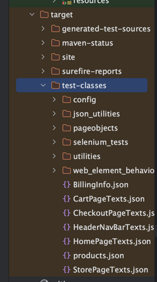
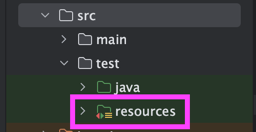

# How the Json utility work.

We are using a dependency called [jackson databind, and you can read more about it here.](https://github.com/FasterXML/jackson-databind)
````java
// Create a pojo class.
public class ProductsPojo {
    public String id;
    public String name;
}
````
```java
public class JsonUtility {
    
    public static <T> T deserializeJson(String fileName, Class<T> T) throws IOException {
        // See more info below regarding this step. It sets the json file under target/test-classes/ during run time.
        InputStream inputStream = JsonUtility.class.getClassLoader().getResourceAsStream(fileName);
        ObjectMapper objectMapper = new ObjectMapper();
        // reads the Json keys and returns matching keys with our Pojo class.
        return objectMapper.readValue(inputStream, T);
    }
}
```
```java
 @Test
    public void expectErrorMessageIfEnteringInvalidCouponCode() {
        // Call the JsonUtility in your test.
        CartPagePojo cartTexts = JsonUtility.deserializeJson("CartPageTexts.json", CartPagePojo.class);
        goToWebSite("/cart");
        By couponCodeDoesNotExistMessage = cartPage.couponDoesNotExistMsgElement;
        expect.element(couponCodeDoesNotExistMessage).toHaveText(cartTexts.couponDoesNotExistMsg);
    }
```
If you noticed, we are not specifying any paths in our test regarding where "CartPageTexts.json" exist.
````java
InputStream inputStream = JsonUtility.class.getClassLoader().getResourceAsStream(fileName);
````
sets the path to "target/test-classes/" during run time. All you have to do is provide the filename.


However, the json file must be created under a maven resource folder, which exist in src/test/resources in order to work.  
If you try to add a new json file anywhere else, jackson data binder will throw an error saying src argument is null.

