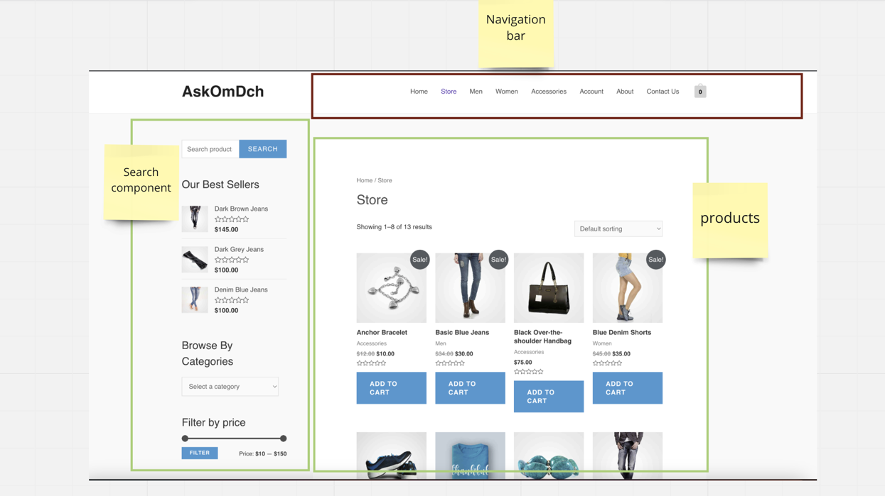

# Page object design.

The page objects follow the [single responsibility principle.](https://www.freecodecamp.org/news/solid-principles-single-responsibility-principle-explained/)  
One whole page is often too big for one class to contain. Therefore, splitting it into several different classes makes   
maintenance more manageable. If the page gets additional features, it allows for simple implementation by adding another class.

To demonstrate, see the picture below.
 - The navigation bar is common and is visible on all pages of the website. Therefore its placed under the common-component folder, so that other pages also may reuse the class.
 - The Products and the search component belongs only to this page, and therefor will be placed under the StorePage object as child classes.



````java
 // One parent class is created to access all of the child classes.
// No locators or WebElements are stored in the parent class.
public class StorePage {
    public SearchComponent getSearchComponent;
    public ProductsComponent getProductsComponent;
    public HeaderNavigationBar getHeaderNavBarComponent;

    public StorePage(WebDriver driver) throws FileNotFoundException {
        this.getHeaderNavBarComponent = HeaderNavigationBar.getInstance(driver);
        this.getSearchComponent = new SearchComponent(driver);
        this.getProductsComponent = new ProductsComponent(driver);
    }
````
```java
// The pages methods and locators are stored in its child classes or component.
public class SearchComponent {
    private final PerformWebElementActions perform;
    private final By searchInputElement = By.cssSelector("#woocommerce-product-search-field-0");
    private final By searchBtnElement = By.cssSelector("form[role='search'] button");
    private final By browseByCategorySelectElement = By.cssSelector("#product_cat");

    public SearchComponent(WebDriver driver) throws FileNotFoundException {
        this.perform = PerformWebElementActions.getInstance(driver);

    }

    public void browseByCategory(String dropdownValue) throws Exception {
        perform.selectDropdownValue(dropdownValue, browseByCategorySelectElement);
    }

    public SearchComponent searchForProduct(String nameOfProduct) throws Exception {
        perform.fillInputWithValue(nameOfProduct, searchInputElement);
        perform.clickOn(searchBtnElement);
        return this;
    }
```
````java
 // Once can now easily jump between classes.
//  Single responsibility principle by default gives greater readability of the code.
 StorePage storePage = new StorePage(driver);
 storePage.getSearchComponent.searchForProduct("Denim blue jeans");
````