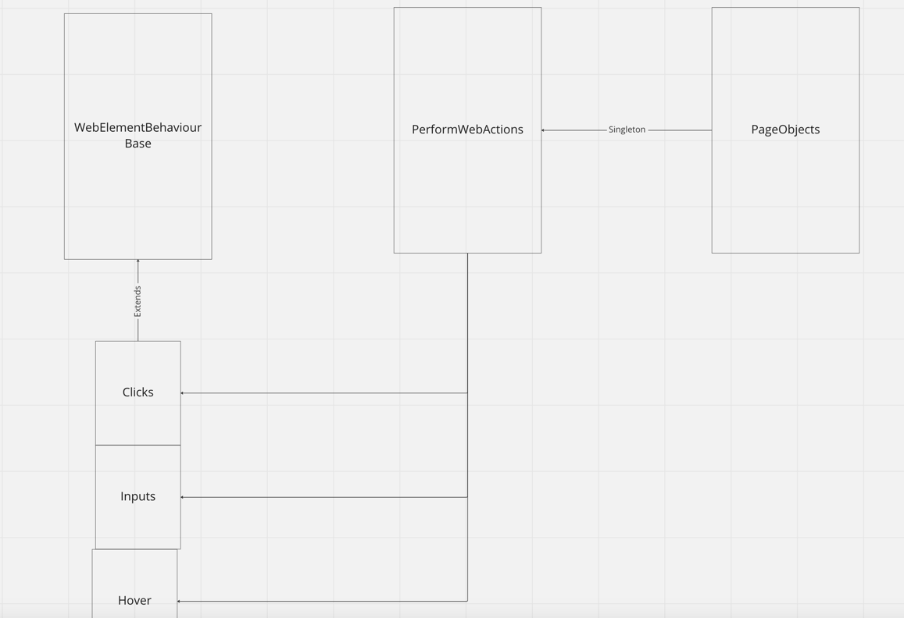

<h1 align="center">
  Web Element Behaviour
</h1>
 Web Element Behaviour class was created in order to add auto waits and retries for  
web actions, such as clicks / fill input, selet dropdowns and more.

### Architectural structure
I went with a simple and scalable approach. One class was created for each type of interaction with the HTML.  
One base class was added to hold common methods and to initialize FluentWait && Webdriver wait once.

[PerformWebActions](https://github.com/oscargforce/Selenium-Java-Framework/blob/main/src/test/java/web_element_behaviour/PerformWebElementActions.java) creates an instance for each type of interaction, which brings all kinds of interactions together in one class. The page objects could have extended the [PerformWebActions](https://github.com/oscargforce/Selenium-Java-Framework/blob/main/src/test/java/web_element_behaviour/PerformWebElementActions.java), but I did not want to bind them so tightly and went for a singleton approach instead.



````java
// src/test/java/web_element_behaviour/WebElementBehaviourBase
public class WebElementBehaviourBase {
    // Timeout are set in rc/test/java/config.properties files.
    protected int waitForElementTimeOut; // Timeout for each web interaction (clicks, select, etc )
    protected int assertionTimeOut; // Same timeout as above but for assertions. Usually you want the time out shorter than waiting for an element to be visible.

    protected WebDriver driver;
    protected FluentWait<WebDriver> wait;
    protected FluentWait<WebDriver> assertionWait;
    protected  JavascriptExecutor javascript;

    public WebElementBehaviourBase(WebDriver driver) throws FileNotFoundException {
        this.driver = driver;
        this.waitForElementTimeOut = ConfigLoader.getInstance().getWaitForElementTimeOut();
        this.wait = new WebDriverWait(driver, Duration.ofSeconds(waitForElementTimeOut)).ignoring(StaleElementReferenceException.class);
        this.assertionTimeOut = ConfigLoader.getInstance().getAssertionTimeOut();
        this.assertionWait = new WebDriverWait(driver, Duration.ofSeconds(assertionTimeOut)).ignoring(StaleElementReferenceException.class);
        this.javascript = (JavascriptExecutor) driver;
    }
````
```java
// src/test/java/web_element_behaviour/Clicks
public class Clicks extends WebElementBehaviourBase {

    public Clicks(WebDriver driver) throws FileNotFoundException {
        super(driver);
    }
    private void waitUntilElementIsClickable(By locator) {
        try {
            wait.until((driver) -> driver.findElement(locator).isDisplayed() && driver.findElement(locator).isEnabled());
        } catch (Exception e) {
            throw new TimeoutException("Tried waiting for " + waitForElementTimeOut + " seconds for locator: " + locator + " to be clickable. ");
        }
    }

    public void webDriverClick(By locator) throws Exception {
        waitUntilElementIsClickable(locator);
        scrollIntoViewIfNeeded(locator);
        // wait.until() -> Needs to return true in order to be resolved and exit the retry loop.
        wait.until((driver) -> {
            try {
                driver.findElement(locator).click();
                return true;
            } catch (Exception e) {
                e.printStackTrace();
                return false;
            }
        });
```
```java
// src/test/java/web_element_behaviour/PerformWebElementActions
public class PerformWebElementActions {
    private static PerformWebElementActions instance;
    private final Clicks typeOfClicks; // Creates a new instance.
    private WebDriver driver; // Creates a local copy of the webdriver. It is used for singleton purposes.

    private PerformWebElementActions(WebDriver driver) throws FileNotFoundException {
        this.driver = driver;
        this.typeOfClicks = new Clicks(driver);

    }
    // When tests are run in parallel a classic singleton if statement does not work.
    // The same tests within a class can not share the instance since they have their own web driver pointing to different pages or sessionIds.
    // We need to make sure that each driver gets its own instance but only one.
    public static PerformWebElementActions getInstance(WebDriver driver) throws FileNotFoundException {
        if (instance != null && driver.equals(instance.driver)) return instance;
        instance = new PerformWebElementActions(driver);
        return instance;
    }

    @Step("Clicking on locator {locator}")
    public void clickOn(By locator) throws Exception {
        typeOfClicks.webDriverClick(locator);
    }

```